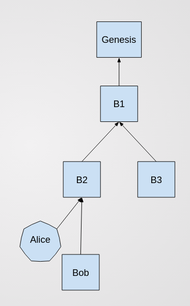

Don't Build on Empty Blocks
=================
Minimizing clutter from empty blocks in ghost-based blockchains

Abstract
----------
Validators form consensus over a shared history by placing capital (social, monetary, or computational) behind a particular alternative for the emerging history. In the many-worlds interpretation of the blockchain, they are voting which world is the real world. Both adding transactions and forming consensus are tied to the act of creating a block. Occasionally a validator wants to participate in consensus but has no new transactions to add. In this case the only thing to do is add an empty blocks to the chain. Empty blocks are not ideal because they take up additional disk space. By adding one rule to the ghost rule we minimize the hassle caused by empty blocks while still allowing their capital for consensus purposes.

Side bonus, blockheight now guarantees that the state of the machine has transitioned.

A bit about GHOST
------------------
The greedy heaviest observed subtree rule does most of the heavy lifting. It was designed to allow the work in pow chains that got orphaned off of the network to still help "secure the network". In fact our big idea is to make empty blocks get orphaned off but still weighted exactly like accidental orphans.

New Rule: Don't Extend Empty Blocks
----------------------------
In order to keep empty blocks out of the main chain, we force them to be orphaned by adding one simply rule. You may build an empty block at any time, but you may not use an empty block as a parent. In PoW chains the blocks must still be kept around if one wants to reconstruct the chain from genesis, but not if one only wishes to validate the main chain. In PoS networks, the blocks may also be discarded entirely because it is never possible to reconstruct from genesis without additional information. (see also: IOU: overlaying PoW on a PoS DAG.)

Examples
-------

### Example 1
There is a fork and Alice wants to support the left side (B2), but has no new transactions to contribute. Alice builds the empty block to show support. It is pictured off to the side in expectation that it will be orphaned.

### Example 2
Bob sees Alice signaling support for a particular chain and wants to contribute a new non-empty block favoring Alice's chain. He doesn't extend her empty block, but builds as a sibling to it.

### Example 3
Bob sees Alice signaling her weight on one side, and wants to show his support as well. Although he will also be building an empty block, he still should not build on Alice's empty block. Bob has lost no expressivity here. They are both supporting the same non-empty block.

### Exercise 4
Claire is a protocol-following validator. Where should she build her block in this diagram assuming all existing blocks have equal weight?

Conclusion
------------
By adding just one rule to the GHOST rule, we ensure that transaction-empty blocks never end up in the main chain. Such blocks may be freely added to participate in consensus, and need not be seen as a nuisance.
