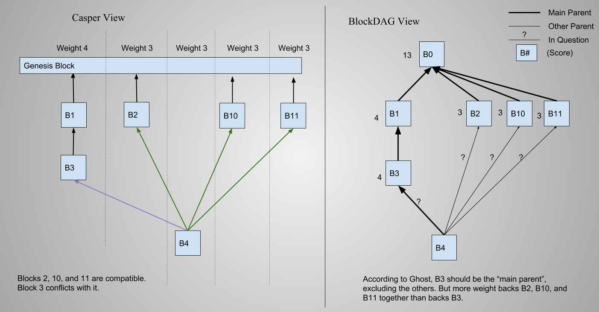

Proof of Work overlay on POS networks
=====================================

History
--------
Ethereum is experimenting with the opposite. Using casper FFG on a POW chain

Casper the Friendly GHOST
----------------------------
Have a local view of the DAG. Compute the main parent according to weights rather than work. That's your main parent. You may also include other non conflicting parents.

Missed Chances
--------------
Casper TFG doesn't guarantee a solution that's optimal in many ways, just one that's easy to calculate and everyone can agree upon. Luckily that's all that's needed for consensus. But it turns out we miss some interesting opportunities.

Exhausting Search
-------------------
It turns out finding the ideal solution is computationally expensive. In fact it is (insert time complexity here). So it might actually be smarter to use the easy-to-compute GHOST rule. Still it would be nice to allow better blocks when we happened to find them. So as a simply back-wards compatible rule change. It's no longer strictly required to build on the ghost-prescribed "main parent". But if you build somewhere else, you must be including more (or equal to?) cumulative weight than you would be by following GHOST.

So why bother? / Incentives?
--------------------------
Does this solve the problem of "you can't reconstruct the chain from genesis"? I think so. Can we prove that?

Would it be possible or wise to incentivize this somehow? Could it be done post-network-launch by a user-deployed contract?
